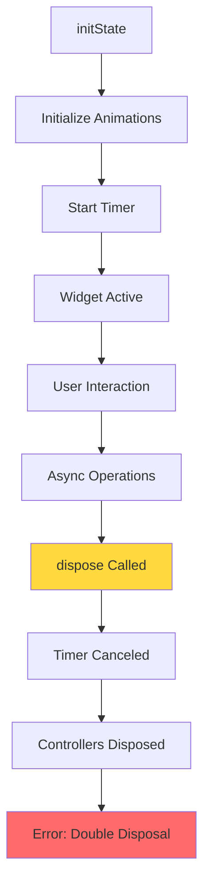
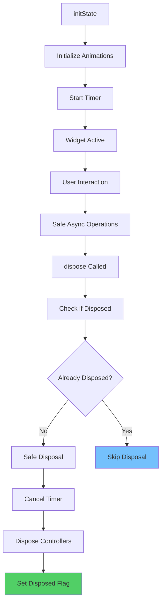
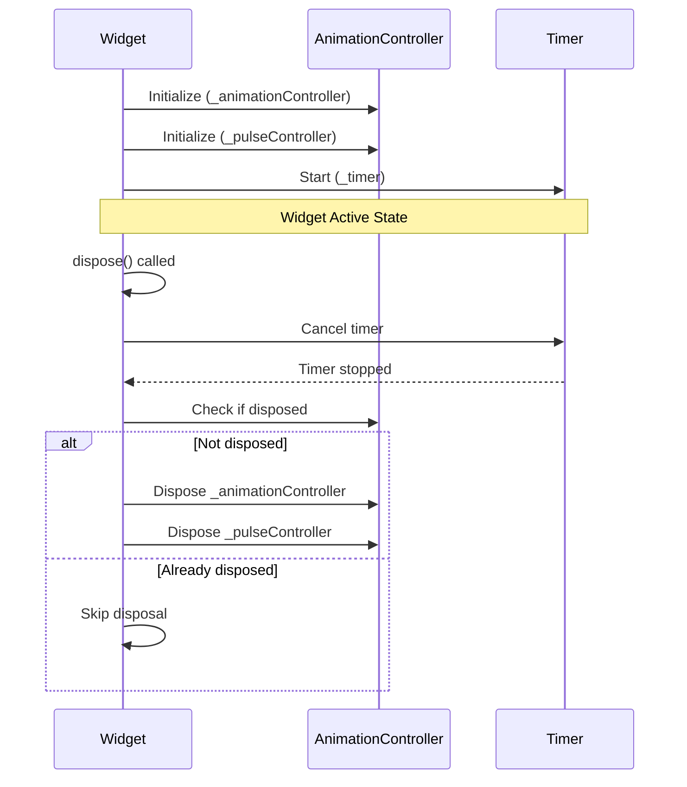
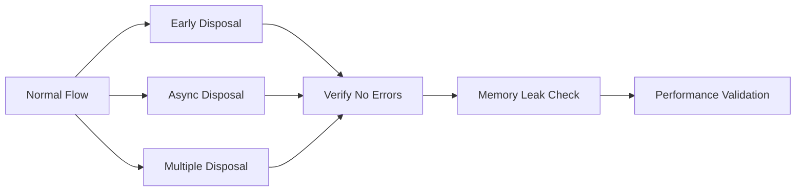

# OTP Verification Screen Bug Fix Design

## Overview

The OTP verification screen is experiencing a critical bug where `ChangeNotifier.debugAssertNotDisposed` is being triggered during widget disposal. This error occurs when animation controllers (which extend `ChangeNotifier`) are being disposed multiple times or accessed after disposal, leading to runtime exceptions and potential app crashes.

## Problem Analysis

### Root Cause
The error stack trace indicates that the issue originates from line 102 in `otp_verification_screen.dart` within the `dispose()` method. The problem stems from improper lifecycle management of animation controllers that extend `ChangeNotifier`.

### Error Pattern
```
ChangeNotifier.debugAssertNotDisposed -> ChangeNotifier.dispose -> _OTPVerificationScreenState.dispose
```

### Current Implementation Issues
1. **Multiple Disposal Risk**: Animation controllers may be disposed multiple times
2. **Async Operation Conflicts**: Timer operations continuing after widget disposal
3. **State Updates After Disposal**: `setState` calls on unmounted widgets
4. **Missing Disposal Guards**: No checks to prevent disposal of already disposed controllers

## Architecture

### Current Widget Lifecycle Flow



### Proposed Fix Architecture



## Component Architecture

### State Management Structure

| Component | Current Issue | Proposed Solution |
|-----------|---------------|-------------------|
| AnimationController | Double disposal | Disposal guard with null checks |
| Timer | Continues after disposal | Early cancellation with mounted check |
| State Updates | setState on unmounted widget | Mounted validation before setState |
| Async Operations | No disposal awareness | Mounted checks in async callbacks |

### Animation Controller Lifecycle



## Data Models & State

### Disposal State Tracking

```dart
class DisposalState {
  bool _isDisposed = false;
  bool _isDisposing = false;
  
  bool get isDisposed => _isDisposed;
  bool get isDisposing => _isDisposing;
  bool get canDispose => !_isDisposed && !_isDisposing;
}
```

### Animation Controller Wrapper

```dart
class SafeAnimationController {
  AnimationController? _controller;
  bool _isDisposed = false;
  
  void dispose() {
    if (!_isDisposed && _controller != null) {
      _isDisposed = true;
      _controller!.dispose();
      _controller = null;
    }
  }
}
```

## Business Logic Layer

### Safe Disposal Pattern

```mermaid
flowchart TD
    A[dispose() Called] --> B[Set Disposing Flag]
    B --> C{Timer Active?}
    C -->|Yes| D[Cancel Timer]
    C -->|No| E[Check Controllers]
    D --> E
    E --> F{Controllers Exist?}
    F -->|Yes| G[Check if Disposed]
    F -->|No| H[Set Disposed Flag]
    G --> I{Already Disposed?}
    I -->|No| J[Dispose Controllers]
    I -->|Yes| H
    J --> K[Nullify References]
    K --> H
```

### Async Operation Safety

| Operation | Current Risk | Safe Pattern |
|-----------|--------------|--------------|
| _sendOTP | setState after disposal | `if (mounted) setState(...)` |
| _verifyOTP | Navigation after disposal | `if (!mounted) return` |
| Timer callbacks | State updates after disposal | Check mounted before setState |
| Animation callbacks | Controller access after disposal | Null checks and mounted validation |

## Testing Strategy

### Unit Test Categories

1. **Disposal Safety Tests**
   - Multiple dispose calls
   - Dispose during async operations
   - Timer cancellation verification

2. **Animation Lifecycle Tests**
   - Controller initialization
   - Animation state during disposal
   - Memory leak detection

3. **State Management Tests**
   - Mounted state validation
   - setState safety checks
   - Async operation cancellation

### Test Scenarios



## Implementation Guidelines

### Critical Fix Points

1. **Disposal Guard Implementation**
   ```dart
   bool _isDisposed = false;
   
   @override
   void dispose() {
     if (_isDisposed) return;
     _isDisposed = true;
     // Safe disposal logic
   }
   ```

2. **Safe setState Pattern**
   ```dart
   void _safeSetState(VoidCallback callback) {
     if (mounted && !_isDisposed) {
       setState(callback);
     }
   }
   ```

3. **Timer Safety**
   ```dart
   void _startResendTimer() {
     _timer?.cancel();
     if (!mounted || _isDisposed) return;
     _timer = Timer.periodic(...);
   }
   ```

4. **Animation Controller Safety**
   ```dart
   void _disposeControllers() {
     if (_animationController != null && !_animationController!.isDisposed) {
       _animationController!.dispose();
     }
     if (_pulseController != null && !_pulseController!.isDisposed) {
       _pulseController!.dispose();
     }
   }
   ```

### Error Prevention Checklist

- [ ] Implement disposal guard flag
- [ ] Add mounted checks before setState
- [ ] Validate controller state before disposal
- [ ] Cancel timers before disposal
- [ ] Add null safety checks
- [ ] Implement safe async operation patterns
- [ ] Add disposal state tracking
- [ ] Validate navigation safety

## Risk Mitigation

### High Priority Fixes
1. **Immediate**: Add disposal guards to prevent double disposal
2. **Critical**: Implement mounted checks for all setState calls
3. **Important**: Add controller state validation before disposal

### Performance Considerations
- Minimal overhead from disposal checks
- No impact on user experience
- Prevents memory leaks from undisposed controllers
- Eliminates crash risk from disposal errors

### Backward Compatibility
- No breaking changes to public API
- Internal implementation improvements only
- Maintains existing functionality and behavior