# e-Disha Project Improvement Analysis & Design

## Overview

Based on comprehensive analysis of the e-Disha Flutter application, this document provides strategic improvement recommendations across architecture, security, performance, user experience, and scalability dimensions. The current project demonstrates solid foundation with modern UI/UX, Provider state management, and cross-platform support, but has significant opportunities for enhancement.

## Current Architecture Assessment

### Strengths Identified
- **Modular Structure**: Well-organized separation of screens, services, providers, and widgets
- **Cross-Platform Support**: Full Flutter implementation for Android, iOS, Web, Desktop
- **Modern UI**: Material Design 3 with dark/light theme support
- **State Management**: Provider pattern implementation
- **Environment Configuration**: .env file integration

### Critical Gaps
- **Incomplete Implementation**: Mock data throughout, placeholder screens
- **Limited Testing**: Only basic widget test available
- **Security Vulnerabilities**: No authentication state management, unprotected routes
- **Performance Issues**: No caching strategy, memory management concerns
- **API Integration**: Missing backend connectivity layer

## Architecture Improvements

### Enhanced State Management Architecture

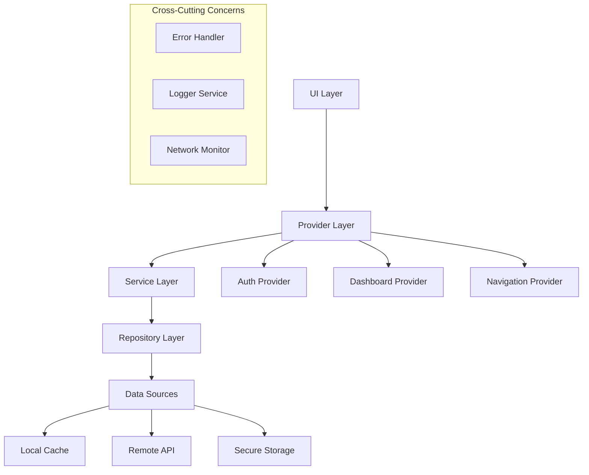

### Repository Pattern Implementation

| Repository | Responsibilities | Data Sources |
|------------|-----------------|--------------|
| **AuthRepository** | Authentication, token management | Firebase Auth, Secure Storage |
| **DashboardRepository** | Analytics data, metrics | REST API, Local Cache |
| **VehicleRepository** | Vehicle data, tracking info | WebSocket, SQLite |
| **UserRepository** | Profile, preferences | API, SharedPreferences |
| **NotificationRepository** | Push notifications, alerts | FCM, Local Storage |

### Service Layer Enhancement

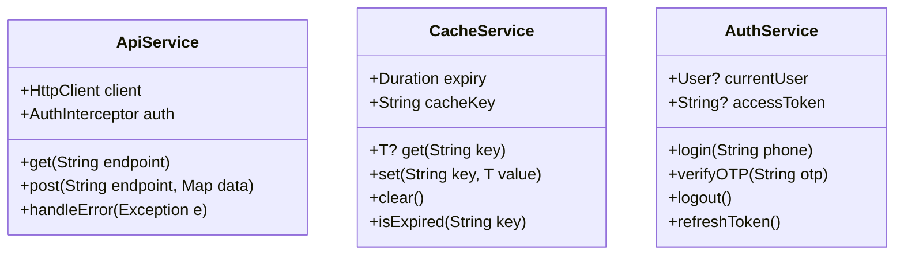

## Security Improvements

### Authentication & Authorization

#### Current Security Gaps
- No JWT token handling
- Unprotected route navigation
- Missing biometric authentication
- No secure storage for sensitive data

#### Proposed Security Architecture

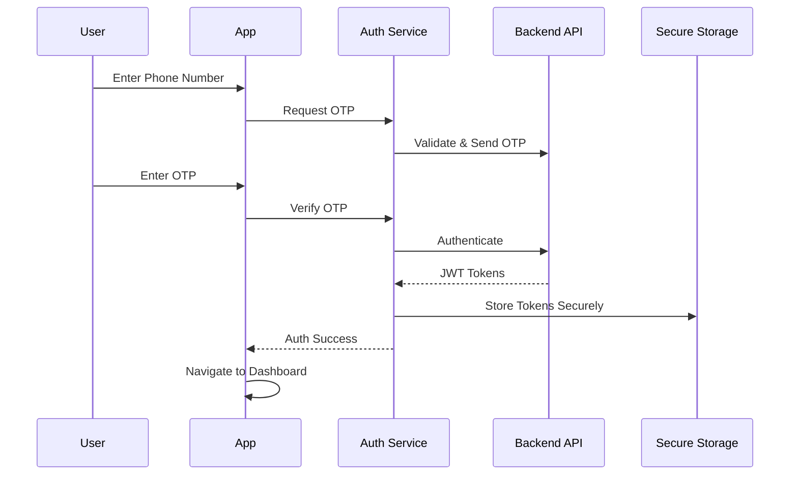

#### Security Implementation Requirements

| Security Feature | Implementation | Priority |
|------------------|----------------|----------|
| **Token Management** | JWT with refresh token rotation | Critical |
| **Biometric Auth** | Local authentication for app access | High |
| **Certificate Pinning** | SSL pinning for API communication | High |
| **Secure Storage** | Encrypted storage for sensitive data | Critical |
| **Session Management** | Auto-logout, session timeout | Medium |
| **API Security** | Request signing, rate limiting | High |

### Data Protection Strategy

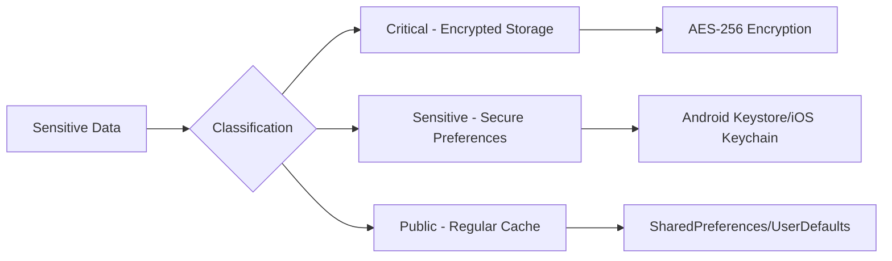

## Performance Optimization

### Memory Management

#### Current Performance Issues
- Large widget trees in dashboard (1800+ lines)
- No image caching strategy
- Potential memory leaks in animation controllers
- Inefficient list rendering

#### Performance Enhancement Strategy

| Optimization Area | Current Issue | Proposed Solution |
|-------------------|---------------|-------------------|
| **Widget Efficiency** | Monolithic dashboard widget | Break into smaller, cached widgets |
| **Image Handling** | No caching mechanism | Implement cached_network_image |
| **List Performance** | Standard ListView | Use ListView.builder with pagination |
| **Animation Memory** | Controllers not disposed | Implement proper disposal pattern |
| **State Updates** | Frequent rebuilds | Selective widget rebuilding |

### Caching Architecture

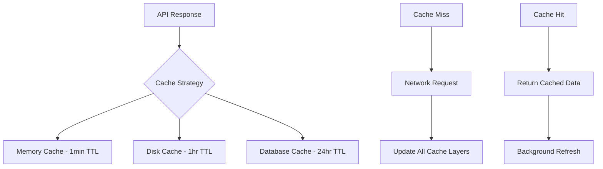

### Network Optimization

```dart
// Proposed HTTP Client Configuration
class OptimizedHttpClient {
  static final client = http.Client();
  
  // Connection pooling
  static const maxConnections = 5;
  
  // Request timeout configuration
  static const connectTimeout = Duration(seconds: 10);
  static const receiveTimeout = Duration(seconds: 15);
  
  // Retry mechanism with exponential backoff
  static const maxRetries = 3;
  static const retryDelay = Duration(seconds: 2);
}
```

## Feature Enhancements

### Real-time Capabilities

#### WebSocket Integration for Live Tracking

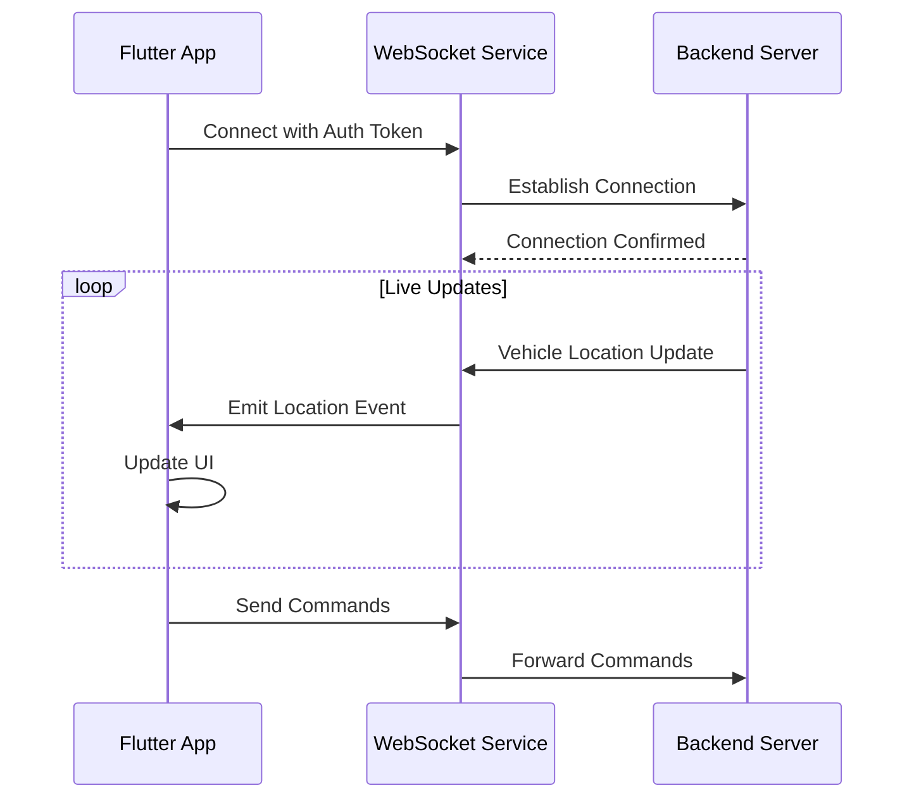

#### Offline Support Strategy

| Data Type | Offline Strategy | Sync Strategy |
|-----------|------------------|---------------|
| **Critical Data** | Always cached, encrypted | Immediate sync on connection |
| **Analytics** | 7-day rolling cache | Batch sync every 5 minutes |
| **User Actions** | Queue with retry logic | Process queue on reconnection |
| **Assets** | Pre-download critical assets | Lazy load non-critical |

### Advanced Dashboard Features

#### Enhanced Analytics Components

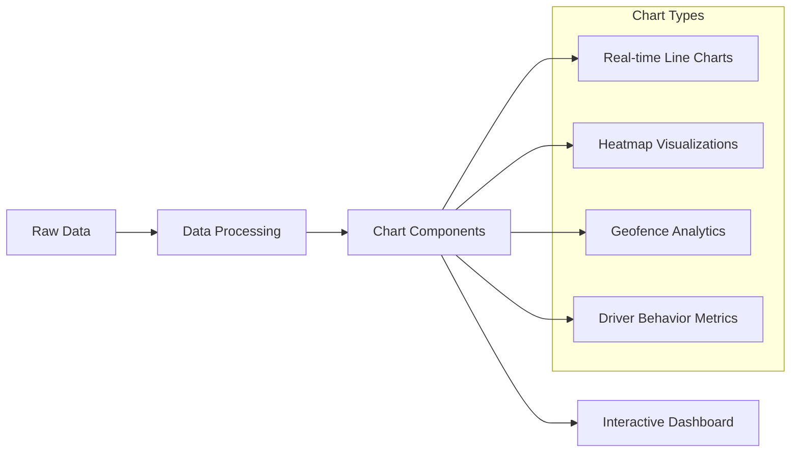

## Testing Strategy

### Current Testing Gaps
- Only basic widget test exists
- No integration tests
- No API testing
- Missing performance tests

### Comprehensive Testing Architecture

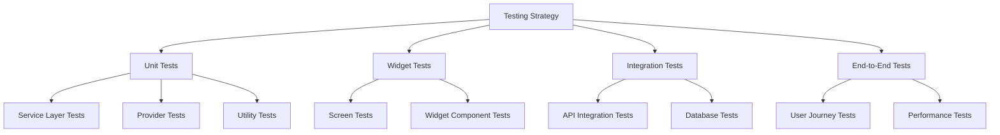

### Testing Implementation Plan

| Test Type | Coverage Target | Framework | Priority |
|-----------|-----------------|-----------|----------|
| **Unit Tests** | 80%+ | flutter_test | Critical |
| **Widget Tests** | 70%+ | flutter_test | High |
| **Integration** | Key flows | integration_test | High |
| **API Tests** | All endpoints | http_mock_adapter | Medium |
| **Performance** | Critical paths | flutter_driver | Medium |

## Code Quality Improvements

### Static Analysis Enhancement

```yaml
# analysis_options.yaml improvements
analyzer:
  strong-mode:
    implicit-casts: false
    implicit-dynamic: false
  
linter:
  rules:
    # Performance rules
    - avoid_function_literals_in_foreach_calls
    - prefer_const_constructors
    - prefer_const_literals_to_create_immutables
    
    # Security rules
    - avoid_web_libraries_in_flutter
    - secure_pubspec_urls
    
    # Code quality
    - prefer_final_locals
    - unnecessary_null_checks
    - use_super_parameters
```

### Documentation Standards

| Documentation Type | Current State | Improvement Required |
|---------------------|---------------|---------------------|
| **API Documentation** | Missing | Comprehensive Dart docs |
| **Architecture Docs** | Basic README | Detailed design docs |
| **User Guides** | None | Setup and usage guides |
| **Contributing Guide** | Basic | Detailed guidelines |

## Deployment & DevOps

### CI/CD Pipeline Architecture

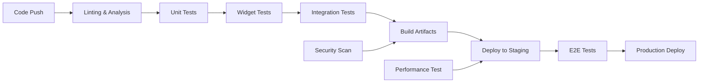

### Environment Management

| Environment | Purpose | Configuration |
|-------------|---------|---------------|
| **Development** | Local development | Mock APIs, debug mode |
| **Staging** | Pre-production testing | Staging APIs, release mode |
| **Production** | Live application | Production APIs, optimized |

## Error Handling & Monitoring

### Comprehensive Error Strategy

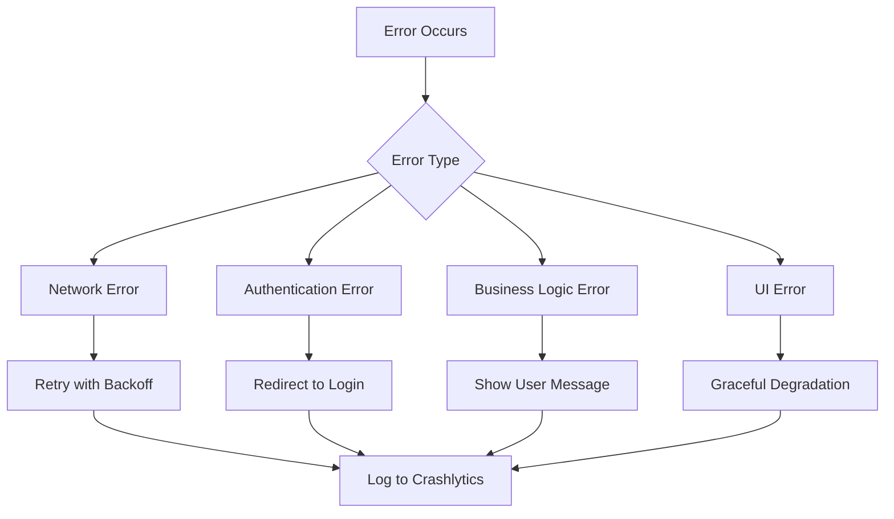

### Monitoring Implementation

| Metric Type | Tool | Purpose |
|-------------|------|---------|
| **Crash Reporting** | Firebase Crashlytics | App stability monitoring |
| **Performance** | Firebase Performance | App speed and responsiveness |
| **Analytics** | Firebase Analytics | User behavior tracking |
| **Network** | Custom interceptors | API call monitoring |

## Scalability Considerations

### Modular Architecture for Growth

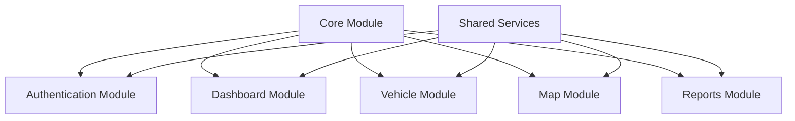

### Database Strategy

| Data Type | Storage Solution | Justification |
|-----------|------------------|---------------|
| **User Sessions** | Secure Storage | Security requirement |
| **Cache Data** | SQLite | Offline capability |
| **App Settings** | SharedPreferences | Simple key-value storage |
| **Large Assets** | File System | Performance optimization |

## Critical Performance Fixes Implementation

### Issue 1: Large Widget Trees in Dashboard (1800+ lines)

#### Problem Analysis
The current `dashboard_screen.dart` contains 1800+ lines in a single file, creating:
- **Memory Overhead**: Entire widget tree loads at once
- **Build Performance**: Slow rebuilds affect UI responsiveness
- **Code Maintenance**: Difficult to debug and modify
- **Hot Reload Impact**: Slower development cycles

#### Solution Architecture

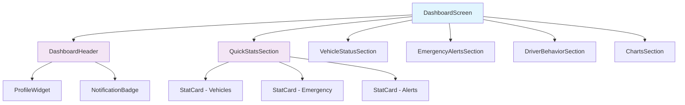

#### Modular Widget Structure

| Widget Component | Responsibility | Line Estimate | Performance Benefit |
|------------------|----------------|---------------|--------------------|
| **DashboardHeader** | App bar, profile, notifications | ~150 lines | Isolated rebuilds |
| **QuickStatsSection** | Summary cards with animations | ~200 lines | Conditional rendering |
| **VehicleStatusSection** | Vehicle status grid/list | ~250 lines | Lazy loading |
| **EmergencyAlertsSection** | Alert cards and actions | ~180 lines | Event-driven updates |
| **DriverBehaviorSection** | Driver metrics display | ~200 lines | Chart optimization |
| **ChartsSection** | Analytics visualizations | ~300 lines | Async chart rendering |

#### Implementation Strategy

**Step 1: Extract Header Component**
```dart
// lib/widgets/dashboard/dashboard_header.dart
class DashboardHeader extends StatelessWidget {
  const DashboardHeader({super.key});

  @override
  Widget build(BuildContext context) {
    return Container(
      padding: const EdgeInsets.all(16),
      child: Row(
        children: [
          _buildProfileSection(),
          const Spacer(),
          _buildNotificationSection(),
          _buildThemeToggle(),
        ],
      ),
    );
  }
}
```

**Step 2: Create Reusable Stat Cards**
```dart
// lib/widgets/dashboard/stat_card.dart
class StatCard extends StatelessWidget {
  final String title;
  final String value;
  final IconData icon;
  final Color color;
  final VoidCallback? onTap;
  
  const StatCard({
    super.key,
    required this.title,
    required this.value,
    required this.icon,
    required this.color,
    this.onTap,
  });

  @override
  Widget build(BuildContext context) {
    return Card(
      elevation: 2,
      child: InkWell(
        onTap: onTap,
        borderRadius: BorderRadius.circular(12),
        child: Container(
          padding: const EdgeInsets.all(16),
          child: Column(
            crossAxisAlignment: CrossAxisAlignment.start,
            children: [
              Row(
                children: [
                  Icon(icon, color: color, size: 24),
                  const Spacer(),
                  Text(
                    value,
                    style: Theme.of(context).textTheme.headlineSmall?.copyWith(
                      fontWeight: FontWeight.bold,
                      color: color,
                    ),
                  ),
                ],
              ),
              const SizedBox(height: 8),
              Text(
                title,
                style: Theme.of(context).textTheme.bodyMedium?.copyWith(
                  color: Theme.of(context).colorScheme.onSurface.withOpacity(0.7),
                ),
              ),
            ],
          ),
        ),
      ),
    );
  }
}
```

### Issue 2: No Image Caching Strategy

#### Problem Analysis
- **Network Overhead**: Repeated image downloads
- **Memory Usage**: No image compression or resizing
- **Poor UX**: Slow loading, no placeholder handling
- **Data Consumption**: Unnecessary bandwidth usage

#### Image Caching Architecture

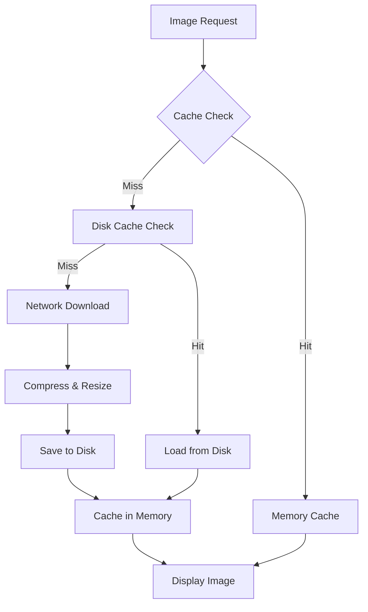

#### Implementation Solution

**Step 1: Add Dependencies**
```yaml
# pubspec.yaml
dependencies:
  cached_network_image: ^3.3.0
  flutter_cache_manager: ^3.3.1
```

**Step 2: Create Custom Image Widget**
```dart
// lib/widgets/common/cached_image.dart
class CachedImage extends StatelessWidget {
  final String imageUrl;
  final double? width;
  final double? height;
  final BoxFit fit;
  final Widget? placeholder;
  final Widget? errorWidget;
  
  const CachedImage({
    super.key,
    required this.imageUrl,
    this.width,
    this.height,
    this.fit = BoxFit.cover,
    this.placeholder,
    this.errorWidget,
  });

  @override
  Widget build(BuildContext context) {
    return CachedNetworkImage(
      imageUrl: imageUrl,
      width: width,
      height: height,
      fit: fit,
      placeholder: (context, url) => placeholder ?? 
        Container(
          width: width,
          height: height,
          decoration: BoxDecoration(
            color: Theme.of(context).colorScheme.surfaceVariant,
            borderRadius: BorderRadius.circular(8),
          ),
          child: const Center(
            child: CircularProgressIndicator(strokeWidth: 2),
          ),
        ),
      errorWidget: (context, url, error) => errorWidget ??
        Container(
          width: width,
          height: height,
          decoration: BoxDecoration(
            color: Theme.of(context).colorScheme.errorContainer,
            borderRadius: BorderRadius.circular(8),
          ),
          child: Icon(
            Icons.error_outline,
            color: Theme.of(context).colorScheme.onErrorContainer,
          ),
        ),
      cacheManager: CustomCacheManager.instance,
    );
  }
}
```

**Step 3: Custom Cache Manager**
```dart
// lib/services/custom_cache_manager.dart
class CustomCacheManager {
  static const key = 'edisha_image_cache';
  
  static CacheManager instance = CacheManager(
    Config(
      key,
      stalePeriod: const Duration(days: 7), // Cache for 7 days
      maxNrOfCacheObjects: 200, // Maximum 200 cached images
      repo: JsonCacheInfoRepository(databaseName: key),
      fileSystem: IOFileSystem(key),
      fileService: HttpFileService(),
    ),
  );
  
  // Method to preload critical images
  static Future<void> preloadImages(List<String> imageUrls) async {
    for (String url in imageUrls) {
      try {
        await instance.downloadFile(url);
      } catch (e) {
        debugPrint('Failed to preload image: $url');
      }
    }
  }
  
  // Method to clear cache when needed
  static Future<void> clearCache() async {
    await instance.emptyCache();
  }
}
```

### Issue 3: Potential Memory Leaks in Animation Controllers

#### Problem Analysis
- **Undisposed Controllers**: Animation controllers not properly disposed
- **Listener Accumulation**: Event listeners not removed
- **Timer Leaks**: Periodic timers not cancelled
- **Stream Subscriptions**: Not properly closed

#### Memory Management Architecture

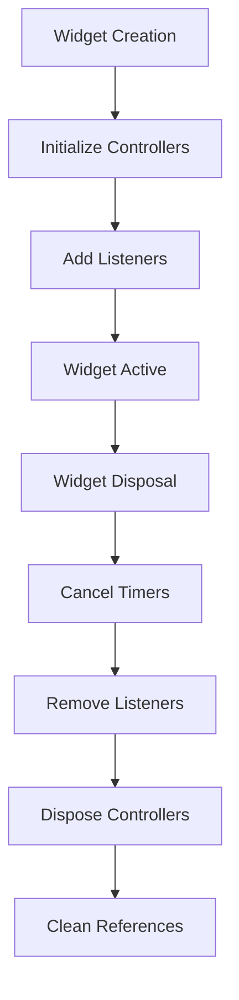

#### Solution Implementation

**Step 1: Animation Controller Management**
```dart
// lib/widgets/dashboard/animated_dashboard.dart
class AnimatedDashboardWidget extends StatefulWidget {
  const AnimatedDashboardWidget({super.key});

  @override
  State<AnimatedDashboardWidget> createState() => _AnimatedDashboardWidgetState();
}

class _AnimatedDashboardWidgetState extends State<AnimatedDashboardWidget>
    with TickerProviderStateMixin {
  
  // Controllers with proper initialization
  late final AnimationController _fadeController;
  late final AnimationController _slideController;
  late final AnimationController _pulseController;
  
  // Timers for cleanup tracking
  Timer? _dataRefreshTimer;
  Timer? _animationTimer;
  
  // Stream subscriptions
  StreamSubscription? _dataSubscription;
  
  @override
  void initState() {
    super.initState();
    _initializeAnimations();
    _startDataRefresh();
  }
  
  void _initializeAnimations() {
    _fadeController = AnimationController(
      duration: const Duration(milliseconds: 800),
      vsync: this,
    );
    
    _slideController = AnimationController(
      duration: const Duration(milliseconds: 1200),
      vsync: this,
    );
    
    _pulseController = AnimationController(
      duration: const Duration(milliseconds: 2000),
      vsync: this,
    );
    
    // Start animations
    _fadeController.forward();
    _slideController.forward();
    _pulseController.repeat();
  }
  
  void _startDataRefresh() {
    _dataRefreshTimer = Timer.periodic(
      const Duration(seconds: 30),
      (timer) {
        if (mounted) {
          // Refresh dashboard data
          _refreshDashboardData();
        }
      },
    );
  }
  
  @override
  void dispose() {
    // Cancel all timers
    _dataRefreshTimer?.cancel();
    _animationTimer?.cancel();
    
    // Cancel stream subscriptions
    _dataSubscription?.cancel();
    
    // Dispose animation controllers
    _fadeController.dispose();
    _slideController.dispose();
    _pulseController.dispose();
    
    super.dispose();
  }
}
```

**Step 2: Memory-Safe Provider Pattern**
```dart
// lib/providers/dashboard_provider.dart
class DashboardProvider extends ChangeNotifier {
  Timer? _refreshTimer;
  StreamSubscription? _dataStream;
  
  void startRealTimeUpdates() {
    // Cancel existing timer to prevent duplicates
    _refreshTimer?.cancel();
    
    _refreshTimer = Timer.periodic(
      const Duration(seconds: 30),
      (timer) => _fetchDashboardData(),
    );
  }
  
  @override
  void dispose() {
    _refreshTimer?.cancel();
    _dataStream?.cancel();
    super.dispose();
  }
}
```

### Issue 4: Inefficient List Rendering

#### Problem Analysis
- **Full List Rendering**: All items rendered simultaneously
- **No Pagination**: Large datasets cause performance issues
- **Expensive Rebuilds**: Entire list rebuilds on data changes
- **Memory Growth**: List items not recycled properly

#### Efficient List Architecture

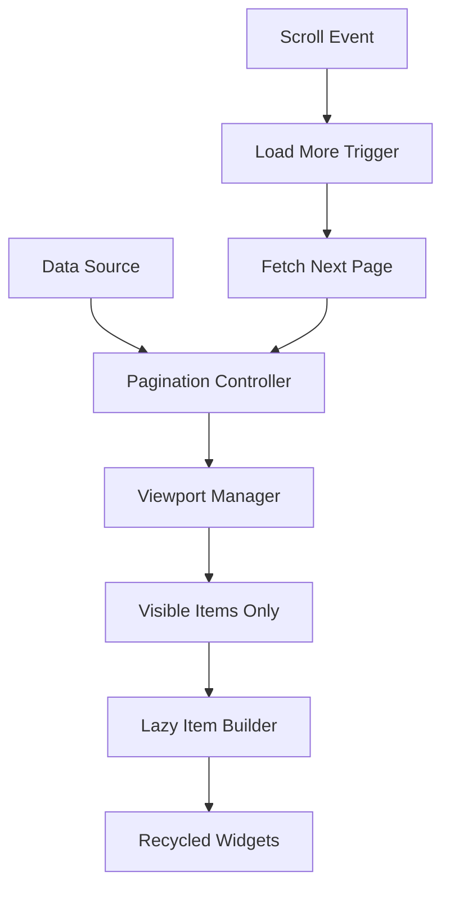

#### Implementation Solutions

**Step 1: Efficient Vehicle List**
```dart
// lib/widgets/dashboard/vehicle_list.dart
class EfficientVehicleList extends StatefulWidget {
  final List<Vehicle> vehicles;
  final Function(Vehicle) onVehicleTap;
  
  const EfficientVehicleList({
    super.key,
    required this.vehicles,
    required this.onVehicleTap,
  });

  @override
  State<EfficientVehicleList> createState() => _EfficientVehicleListState();
}

class _EfficientVehicleListState extends State<EfficientVehicleList> {
  final ScrollController _scrollController = ScrollController();
  static const int _itemsPerPage = 20;
  int _currentPage = 0;
  bool _isLoading = false;
  
  @override
  void initState() {
    super.initState();
    _scrollController.addListener(_onScroll);
  }
  
  void _onScroll() {
    if (_scrollController.position.pixels >=
        _scrollController.position.maxScrollExtent * 0.8) {
      _loadMoreItems();
    }
  }
  
  Future<void> _loadMoreItems() async {
    if (_isLoading) return;
    
    setState(() {
      _isLoading = true;
    });
    
    // Simulate loading delay
    await Future.delayed(const Duration(milliseconds: 500));
    
    setState(() {
      _currentPage++;
      _isLoading = false;
    });
  }
  
  @override
  Widget build(BuildContext context) {
    final displayedItems = widget.vehicles
        .take((_currentPage + 1) * _itemsPerPage)
        .toList();
    
    return ListView.separated(
      controller: _scrollController,
      itemCount: displayedItems.length + (_isLoading ? 1 : 0),
      separatorBuilder: (context, index) => const SizedBox(height: 8),
      itemBuilder: (context, index) {
        if (index == displayedItems.length) {
          return const Center(
            child: Padding(
              padding: EdgeInsets.all(16),
              child: CircularProgressIndicator(),
            ),
          );
        }
        
        return VehicleListItem(
          vehicle: displayedItems[index],
          onTap: () => widget.onVehicleTap(displayedItems[index]),
        );
      },
    );
  }
  
  @override
  void dispose() {
    _scrollController.dispose();
    super.dispose();
  }
}
```

**Step 2: Optimized List Item Widget**
```dart
// lib/widgets/dashboard/vehicle_list_item.dart
class VehicleListItem extends StatelessWidget {
  final Vehicle vehicle;
  final VoidCallback onTap;
  
  const VehicleListItem({
    super.key,
    required this.vehicle,
    required this.onTap,
  });

  @override
  Widget build(BuildContext context) {
    return Card(
      margin: const EdgeInsets.symmetric(horizontal: 16),
      child: ListTile(
        contentPadding: const EdgeInsets.all(12),
        leading: CircleAvatar(
          backgroundColor: vehicle.isActive ? Colors.green : Colors.red,
          child: Icon(
            Icons.directions_car,
            color: Colors.white,
          ),
        ),
        title: Text(
          vehicle.name,
          style: const TextStyle(fontWeight: FontWeight.bold),
        ),
        subtitle: Column(
          crossAxisAlignment: CrossAxisAlignment.start,
          children: [
            Text('Driver: ${vehicle.driverName}'),
            Text('Status: ${vehicle.status}'),
          ],
        ),
        trailing: Column(
          mainAxisAlignment: MainAxisAlignment.center,
          children: [
            Icon(
              vehicle.isActive ? Icons.circle : Icons.circle_outlined,
              color: vehicle.isActive ? Colors.green : Colors.grey,
              size: 12,
            ),
            const SizedBox(height: 4),
            Text(
              vehicle.isActive ? 'Online' : 'Offline',
              style: TextStyle(
                fontSize: 12,
                color: vehicle.isActive ? Colors.green : Colors.grey,
              ),
            ),
          ],
        ),
        onTap: onTap,
      ),
    );
  }
}
```

## Performance Monitoring Setup

### Memory Leak Detection
```dart
// lib/utils/performance_monitor.dart
class PerformanceMonitor {
  static void trackMemoryUsage() {
    Timer.periodic(const Duration(seconds: 30), (timer) {
      final info = ProcessInfo.currentRss;
      debugPrint('Memory usage: ${info / 1024 / 1024} MB');
    });
  }
  
  static void trackWidgetCount() {
    // Track widget tree depth and count
    WidgetsBinding.instance.addPostFrameCallback((_) {
      final renderObjects = WidgetsBinding.instance.renderView;
      debugPrint('Render objects count: ${renderObjects.depth}');
    });
  }
}
```

## Implementation Roadmap

### Immediate Fixes (Week 1)
1. **Extract Dashboard Components**
   - Break dashboard into 6 separate widget files
   - Implement StatCard component
   - Create DashboardHeader widget

2. **Animation Controller Cleanup**
   - Add proper dispose methods to all StatefulWidgets
   - Cancel timers in dispose methods
   - Remove unused animation controllers

### Week 2: Image Caching
1. **Setup Image Caching**
   - Add cached_network_image dependency
   - Implement CustomCacheManager
   - Replace all Image.network with CachedImage

2. **List Optimization**
   - Implement ListView.builder for all lists
   - Add pagination to vehicle list
   - Optimize list item widgets

## Detailed Implementation Blueprints

### File Structure Changes Required

```
lib/
├── widgets/
│   ├── dashboard/
│   │   ├── dashboard_header.dart          # NEW
│   │   ├── quick_stats_section.dart       # NEW
│   │   ├── vehicle_status_section.dart    # NEW
│   │   ├── emergency_alerts_section.dart  # NEW
│   │   ├── driver_behavior_section.dart   # NEW
│   │   ├── charts_section.dart            # NEW
│   │   ├── stat_card.dart                 # NEW
│   │   ├── vehicle_list.dart              # NEW
│   │   └── vehicle_list_item.dart         # NEW
│   └── common/
│       ├── cached_image.dart              # NEW
│       └── loading_placeholder.dart       # NEW
├── services/
│   ├── custom_cache_manager.dart          # NEW
│   └── performance_monitor.dart           # NEW
├── utils/
│   └── animation_utils.dart               # NEW
└── screens/
    └── dashboard_screen.dart              # MODIFY
```

### Step 1: Create Dashboard Header Component

**File: `lib/widgets/dashboard/dashboard_header.dart`**
```dart
import 'package:flutter/material.dart';
import 'package:provider/provider.dart';
import '../../providers/theme_provider.dart';
import '../../theme/app_colors.dart';

class DashboardHeader extends StatelessWidget {
  const DashboardHeader({super.key});

  @override
  Widget build(BuildContext context) {
    return Container(
      padding: const EdgeInsets.symmetric(horizontal: 16, vertical: 12),
      decoration: BoxDecoration(
        color: Theme.of(context).cardColor,
        boxShadow: [
          BoxShadow(
            color: Colors.black.withOpacity(0.1),
            offset: const Offset(0, 1),
            blurRadius: 3,
          ),
        ],
      ),
      child: Row(
        children: [
          _buildLogo(context),
          const Spacer(),
          _buildNotificationButton(context),
          const SizedBox(width: 8),
          _buildThemeToggle(context),
          const SizedBox(width: 8),
          _buildProfileMenu(context),
        ],
      ),
    );
  }

  Widget _buildLogo(BuildContext context) {
    return Container(
      padding: const EdgeInsets.all(8),
      decoration: BoxDecoration(
        color: Colors.transparent,
        borderRadius: BorderRadius.circular(12),
      ),
      child: Image.asset(
        'lib/assets/images/logo.png',
        height: 32,
        fit: BoxFit.contain,
        errorBuilder: (context, error, stackTrace) => Icon(
          Icons.dashboard_rounded,
          size: 32,
          color: Theme.of(context).colorScheme.onSurface,
        ),
      ),
    );
  }

  Widget _buildNotificationButton(BuildContext context) {
    return Stack(
      children: [
        Container(
          padding: const EdgeInsets.all(8),
          decoration: BoxDecoration(
            color: Theme.of(context)
                .extension<AppColors>()
                ?.border?['default']
                ?.withOpacity(0.3) ?? Colors.grey.withOpacity(0.3),
            borderRadius: BorderRadius.circular(12),
          ),
          child: Icon(
            Icons.notifications_active_outlined,
            color: Theme.of(context).colorScheme.onSurface,
            size: 24,
          ),
        ),
        Positioned(
          right: 6,
          top: 6,
          child: Container(
            width: 12,
            height: 12,
            decoration: BoxDecoration(
              color: Theme.of(context).colorScheme.error,
              shape: BoxShape.circle,
            ),
            child: const Center(
              child: Text(
                '2',
                style: TextStyle(
                  color: Colors.white,
                  fontSize: 8,
                  fontWeight: FontWeight.bold,
                ),
              ),
            ),
          ),
        ),
      ],
    );
  }

  Widget _buildThemeToggle(BuildContext context) {
    return Consumer<ThemeProvider>(
      builder: (context, themeProvider, child) {
        return Container(
          margin: const EdgeInsets.only(right: 8),
          child: IconButton(
            icon: Container(
              padding: const EdgeInsets.all(8),
              decoration: BoxDecoration(
                color: Theme.of(context).brightness == Brightness.dark
                    ? Colors.white.withOpacity(0.2)
                    : Colors.black.withOpacity(0.1),
                borderRadius: BorderRadius.circular(12),
              ),
              child: Icon(
                themeProvider.isDarkMode
                    ? Icons.light_mode
                    : Icons.dark_mode,
                color: Theme.of(context).brightness == Brightness.dark
                    ? Colors.white
                    : Colors.black,
                size: 20,
              ),
            ),
            onPressed: () {
              final provider = Provider.of<ThemeProvider>(context, listen: false);
              provider.setThemeMode(
                  provider.isDarkMode ? ThemeMode.light : ThemeMode.dark);
            },
            tooltip: themeProvider.isDarkMode
                ? 'Switch to Light Mode'
                : 'Switch to Dark Mode',
          ),
        );
      },
    );
  }

  Widget _buildProfileMenu(BuildContext context) {
    return PopupMenuButton<String>(
      icon: Container(
        width: 40,
        height: 40,
        decoration: BoxDecoration(
          gradient: LinearGradient(
            colors: [
              Theme.of(context).colorScheme.primary,
              Theme.of(context).colorScheme.secondary
            ],
            begin: Alignment.topLeft,
            end: Alignment.bottomRight,
          ),
          borderRadius: BorderRadius.circular(20),
          boxShadow: [
            BoxShadow(
              color: Theme.of(context).colorScheme.primary.withOpacity(0.3),
              blurRadius: 8,
              offset: const Offset(0, 2),
            ),
          ],
        ),
        child: const Icon(Icons.person, color: Colors.white, size: 22),
      ),
      color: Theme.of(context).cardColor,
      onSelected: (String result) {
        if (result == 'logout') {
          _performLogout(context);
        }
      },
      itemBuilder: (BuildContext context) => <PopupMenuEntry<String>>[
        PopupMenuItem<String>(
          value: 'welcome',
          child: Column(
            crossAxisAlignment: CrossAxisAlignment.start,
            children: [
              Text(
                'Welcome Back',
                style: TextStyle(
                  fontWeight: FontWeight.bold,
                  color: Theme.of(context).colorScheme.onSurface,
                ),
              ),
              Text(
                'Test Owner',
                style: TextStyle(
                  color: Theme.of(context)
                      .colorScheme
                      .onSurface
                      .withOpacity(0.7),
                ),
              ),
              Divider(
                  color: Theme.of(context)
                      .extension<AppColors>()
                      ?.border?['default']),
            ],
          ),
        ),
        PopupMenuItem<String>(
          value: 'logout',
          child: Row(
            children: [
              Icon(Icons.logout, color: Theme.of(context).colorScheme.error),
              const SizedBox(width: 8),
              const Text('Logout'),
            ],
          ),
        ),
      ],
    );
  }

  Future<void> _performLogout(BuildContext context) async {
    final bool? shouldLogout = await showDialog<bool>(
      context: context,
      builder: (BuildContext context) {
        return AlertDialog(
          backgroundColor: Theme.of(context).cardColor,
          title: Text(
            'Confirm Logout',
            style: TextStyle(color: Theme.of(context).colorScheme.onSurface),
          ),
          content: Text(
            'Are you sure you want to logout?',
            style: TextStyle(
                color: Theme.of(context)
                    .colorScheme
                    .onSurface
                    .withOpacity(0.7)),
          ),
          shape: RoundedRectangleBorder(
            borderRadius: BorderRadius.circular(12),
          ),
          actions: [
            TextButton(
              onPressed: () => Navigator.of(context).pop(false),
              child: Text(
                'Cancel',
                style: TextStyle(
                    color: Theme.of(context)
                        .colorScheme
                        .onSurface
                        .withOpacity(0.7)),
              ),
            ),
            ElevatedButton(
              onPressed: () => Navigator.of(context).pop(true),
              style: ElevatedButton.styleFrom(
                backgroundColor: Theme.of(context).colorScheme.error,
                foregroundColor: Theme.of(context).colorScheme.onError,
              ),
              child: const Text('Logout'),
            ),
          ],
        );
      },
    );

    if (shouldLogout == true) {
      try {
        Navigator.of(context)
            .pushNamedAndRemoveUntil('/login', (Route<dynamic> route) => false);

        Future.delayed(const Duration(milliseconds: 500), () {
          if (context.mounted) {
            ScaffoldMessenger.of(context).showSnackBar(
              const SnackBar(
                content: Text('Successfully logged out'),
                backgroundColor: Color.fromARGB(213, 50, 230, 50),
                behavior: SnackBarBehavior.floating,
              ),
            );
          }
        });
      } catch (e) {
        ScaffoldMessenger.of(context).showSnackBar(
          SnackBar(
            content: Text('Logout failed: $e'),
            backgroundColor: Theme.of(context).colorScheme.error,
            behavior: SnackBarBehavior.floating,
          ),
        );
      }
    }
  }
}
```

### Step 2: Create Reusable Stat Card Component

**File: `lib/widgets/dashboard/stat_card.dart`**
```dart
import 'package:flutter/material.dart';

class StatCard extends StatelessWidget {
  final String title;
  final String value;
  final String? subtitle;
  final IconData icon;
  final Color color;
  final VoidCallback? onTap;
  final bool isLoading;

  const StatCard({
    super.key,
    required this.title,
    required this.value,
    this.subtitle,
    required this.icon,
    required this.color,
    this.onTap,
    this.isLoading = false,
  });

  @override
  Widget build(BuildContext context) {
    return Card(
      elevation: 2,
      shadowColor: color.withOpacity(0.2),
      child: InkWell(
        onTap: onTap,
        borderRadius: BorderRadius.circular(12),
        child: Container(
          padding: const EdgeInsets.all(16),
          decoration: BoxDecoration(
            borderRadius: BorderRadius.circular(12),
            gradient: LinearGradient(
              begin: Alignment.topLeft,
              end: Alignment.bottomRight,
              colors: [
                color.withOpacity(0.1),
                color.withOpacity(0.05),
              ],
            ),
          ),
          child: Column(
            crossAxisAlignment: CrossAxisAlignment.start,
            mainAxisSize: MainAxisSize.min,
            children: [
              Row(
                children: [
                  Container(
                    padding: const EdgeInsets.all(8),
                    decoration: BoxDecoration(
                      color: color.withOpacity(0.2),
                      borderRadius: BorderRadius.circular(8),
                    ),
                    child: Icon(
                      icon,
                      color: color,
                      size: 24,
                    ),
                  ),
                  const Spacer(),
                  if (isLoading)
                    SizedBox(
                      width: 20,
                      height: 20,
                      child: CircularProgressIndicator(
                        strokeWidth: 2,
                        valueColor: AlwaysStoppedAnimation<Color>(color),
                      ),
                    ),
                ],
              ),
              const SizedBox(height: 12),
              Text(
                value,
                style: Theme.of(context).textTheme.headlineSmall?.copyWith(
                  fontWeight: FontWeight.bold,
                  color: color,
                ),
              ),
              const SizedBox(height: 4),
              Text(
                title,
                style: Theme.of(context).textTheme.bodyMedium?.copyWith(
                  color:
                      Theme.of(context).colorScheme.onSurface.withOpacity(0.7),
                  fontWeight: FontWeight.w500,
                ),
              ),
              if (subtitle != null) ..[
                const SizedBox(height: 4),
                Text(
                  subtitle!,
                  style: Theme.of(context).textTheme.bodySmall?.copyWith(
                    color: Theme.of(context)
                        .colorScheme
                        .onSurface
                        .withOpacity(0.6),
                  ),
                ),
              ],
            ],
          ),
        ),
      ),
    );
  }
}
```

### Step 3: Create Quick Stats Section

**File: `lib/widgets/dashboard/quick_stats_section.dart`**
```dart
import 'package:flutter/material.dart';
import 'stat_card.dart';

class QuickStatsSection extends StatelessWidget {
  final Map<String, dynamic> dashboardData;
  final bool isLoading;

  const QuickStatsSection({
    super.key,
    required this.dashboardData,
    this.isLoading = false,
  });

  @override
  Widget build(BuildContext context) {
    return Padding(
      padding: const EdgeInsets.all(16),
      child: Column(
        crossAxisAlignment: CrossAxisAlignment.start,
        children: [
          Text(
            'Quick Stats',
            style: Theme.of(context).textTheme.titleLarge?.copyWith(
              fontWeight: FontWeight.bold,
            ),
          ),
          const SizedBox(height: 16),
          GridView.count(
            shrinkWrap: true,
            physics: const NeverScrollableScrollPhysics(),
            crossAxisCount: 2,
            mainAxisSpacing: 12,
            crossAxisSpacing: 12,
            childAspectRatio: 1.2,
            children: [
              StatCard(
                title: 'Total Vehicles',
                value: '${dashboardData['vehicles']?['total'] ?? 0}',
                subtitle: '${dashboardData['vehicles']?['active'] ?? 0} active',
                icon: Icons.directions_car,
                color: Theme.of(context).colorScheme.primary,
                isLoading: isLoading,
                onTap: () => Navigator.pushNamed(context, '/vehicle-details'),
              ),
              StatCard(
                title: 'Emergency Calls',
                value: '${dashboardData['emergency']?['total'] ?? 0}',
                subtitle: '${dashboardData['emergency']?['genuine'] ?? 0} genuine',
                icon: Icons.emergency,
                color: Theme.of(context).colorScheme.error,
                isLoading: isLoading,
                onTap: () => _showEmergencyDetails(context),
              ),
              StatCard(
                title: 'Active Alerts',
                value: '${dashboardData['alerts']?['today'] ?? 0}',
                subtitle: '${dashboardData['alerts']?['thisMonth'] ?? 0} this month',
                icon: Icons.warning_amber,
                color: Colors.orange,
                isLoading: isLoading,
                onTap: () => _showAlertsDetails(context),
              ),
              StatCard(
                title: 'Driver Issues',
                value: '${_getTotalDriverIssues()}',
                subtitle: 'Last 24 hours',
                icon: Icons.person_alert,
                color: Colors.deepOrange,
                isLoading: isLoading,
                onTap: () => Navigator.pushNamed(context, '/reports'),
              ),
            ],
          ),
        ],
      ),
    );
  }

  int _getTotalDriverIssues() {
    final driverData = dashboardData['driver'] as Map<String, dynamic>? ?? {};
    return (driverData['harshBraking'] ?? 0) +
        (driverData['suddenTurn'] ?? 0) +
        (driverData['overspeeding'] ?? 0);
  }

  void _showEmergencyDetails(BuildContext context) {
    showDialog(
      context: context,
      builder: (context) => AlertDialog(
        title: const Text('Emergency Call Details'),
        content: Column(
          mainAxisSize: MainAxisSize.min,
          crossAxisAlignment: CrossAxisAlignment.start,
          children: [
            Text('Genuine Calls: ${dashboardData['emergency']?['genuine'] ?? 0}'),
            Text('False Alarms: ${dashboardData['emergency']?['fake'] ?? 0}'),
            Text('Total Today: ${dashboardData['emergency']?['total'] ?? 0}'),
          ],
        ),
        actions: [
          TextButton(
            onPressed: () => Navigator.pop(context),
            child: const Text('Close'),
          ),
        ],
      ),
    );
  }

  void _showAlertsDetails(BuildContext context) {
    showDialog(
      context: context,
      builder: (context) => AlertDialog(
        title: const Text('Alert Details'),
        content: Column(
          mainAxisSize: MainAxisSize.min,
          crossAxisAlignment: CrossAxisAlignment.start,
          children: [
            Text('Today: ${dashboardData['alerts']?['today'] ?? 0}'),
            Text('This Month: ${dashboardData['alerts']?['thisMonth'] ?? 0}'),
            Text('Total: ${dashboardData['alerts']?['total'] ?? 0}'),
          ],
        ),
        actions: [
          TextButton(
            onPressed: () => Navigator.pop(context),
            child: const Text('Close'),
          ),
        ],
      ),
    );
  }
}
```

### Step 4: Create Image Caching Components

**File: `lib/services/custom_cache_manager.dart`**
```dart
import 'package:flutter_cache_manager/flutter_cache_manager.dart';
import 'package:flutter/foundation.dart';

class CustomCacheManager {
  static const key = 'edisha_image_cache';

  static CacheManager instance = CacheManager(
    Config(
      key,
      stalePeriod: const Duration(days: 7), // Cache for 7 days
      maxNrOfCacheObjects: 200, // Maximum 200 cached images
      repo: JsonCacheInfoRepository(databaseName: key),
      fileSystem: IOFileSystem(key),
      fileService: HttpFileService(),
    ),
  );

  // Method to preload critical images
  static Future<void> preloadImages(List<String> imageUrls) async {
    for (String url in imageUrls) {
      try {
        await instance.downloadFile(url);
        debugPrint('Preloaded image: $url');
      } catch (e) {
        debugPrint('Failed to preload image: $url - Error: $e');
      }
    }
  }

  // Method to get cache size
  static Future<String> getCacheSize() async {
    final cacheDir = await instance.getTemporaryDirectory();
    int totalSize = 0;
    
    if (cacheDir.existsSync()) {
      cacheDir.listSync(recursive: true).forEach((entity) {
        if (entity is File) {
          totalSize += entity.lengthSync();
        }
      });
    }

    // Convert bytes to MB
    double sizeInMB = totalSize / (1024 * 1024);
    return '${sizeInMB.toStringAsFixed(2)} MB';
  }

  // Method to clear cache when needed
  static Future<void> clearCache() async {
    try {
      await instance.emptyCache();
      debugPrint('Cache cleared successfully');
    } catch (e) {
      debugPrint('Error clearing cache: $e');
    }
  }

  // Method to check cache status
  static Future<bool> isCached(String url) async {
    try {
      final fileInfo = await instance.getFileFromCache(url);
      return fileInfo != null;
    } catch (e) {
      return false;
    }
  }
}
```

**File: `lib/widgets/common/cached_image.dart`**
```dart
import 'package:flutter/material.dart';
import 'package:cached_network_image/cached_network_image.dart';
import '../../services/custom_cache_manager.dart';

class CachedImage extends StatelessWidget {
  final String imageUrl;
  final double? width;
  final double? height;
  final BoxFit fit;
  final Widget? placeholder;
  final Widget? errorWidget;
  final BorderRadius? borderRadius;
  final bool showLoading;

  const CachedImage({
    super.key,
    required this.imageUrl,
    this.width,
    this.height,
    this.fit = BoxFit.cover,
    this.placeholder,
    this.errorWidget,
    this.borderRadius,
    this.showLoading = true,
  });

  @override
  Widget build(BuildContext context) {
    return ClipRRect(
      borderRadius: borderRadius ?? BorderRadius.zero,
      child: CachedNetworkImage(
        imageUrl: imageUrl,
        width: width,
        height: height,
        fit: fit,
        placeholder: (context, url) => placeholder ?? _buildDefaultPlaceholder(context),
        errorWidget: (context, url, error) => errorWidget ?? _buildDefaultErrorWidget(context),
        cacheManager: CustomCacheManager.instance,
        fadeInDuration: const Duration(milliseconds: 300),
        fadeOutDuration: const Duration(milliseconds: 100),
        memCacheWidth: width?.toInt(),
        memCacheHeight: height?.toInt(),
      ),
    );
  }

  Widget _buildDefaultPlaceholder(BuildContext context) {
    return Container(
      width: width,
      height: height,
      decoration: BoxDecoration(
        color: Theme.of(context).colorScheme.surfaceVariant,
        borderRadius: borderRadius ?? BorderRadius.circular(8),
      ),
      child: showLoading
          ? const Center(
              child: CircularProgressIndicator(strokeWidth: 2),
            )
          : Icon(
              Icons.image,
              color: Theme.of(context).colorScheme.onSurfaceVariant,
              size: 32,
            ),
    );
  }

  Widget _buildDefaultErrorWidget(BuildContext context) {
    return Container(
      width: width,
      height: height,
      decoration: BoxDecoration(
        color: Theme.of(context).colorScheme.errorContainer,
        borderRadius: borderRadius ?? BorderRadius.circular(8),
      ),
      child: Icon(
        Icons.error_outline,
        color: Theme.of(context).colorScheme.onErrorContainer,
        size: 32,
      ),
    );
  }
}

// Specialized avatar image widget
class CachedAvatarImage extends StatelessWidget {
  final String imageUrl;
  final double radius;
  final String? fallbackText;
  
  const CachedAvatarImage({
    super.key,
    required this.imageUrl,
    this.radius = 20,
    this.fallbackText,
  });

  @override
  Widget build(BuildContext context) {
    return CircleAvatar(
      radius: radius,
      backgroundColor: Theme.of(context).colorScheme.primary,
      child: ClipOval(
        child: CachedNetworkImage(
          imageUrl: imageUrl,
          width: radius * 2,
          height: radius * 2,
          fit: BoxFit.cover,
          placeholder: (context, url) => Container(
            width: radius * 2,
            height: radius * 2,
            color: Theme.of(context).colorScheme.primary.withOpacity(0.1),
            child: Center(
              child: Text(
                fallbackText ?? '?',
                style: TextStyle(
                  color: Theme.of(context).colorScheme.primary,
                  fontWeight: FontWeight.bold,
                  fontSize: radius * 0.8,
                ),
              ),
            ),
          ),
          errorWidget: (context, url, error) => Container(
            width: radius * 2,
            height: radius * 2,
            color: Theme.of(context).colorScheme.errorContainer,
            child: Icon(
              Icons.person,
              color: Theme.of(context).colorScheme.onErrorContainer,
              size: radius * 1.2,
            ),
          ),
          cacheManager: CustomCacheManager.instance,
        ),
      ),
    );
  }
}
```